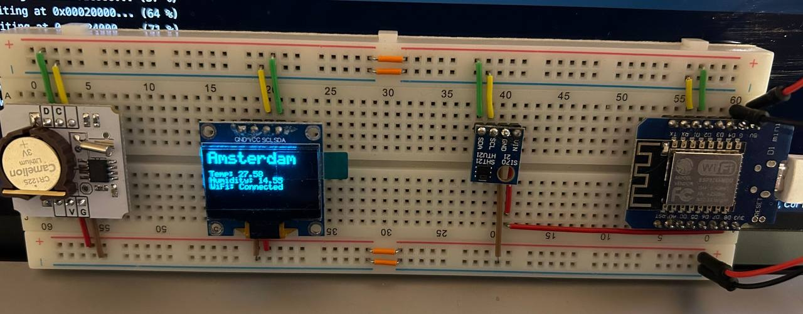
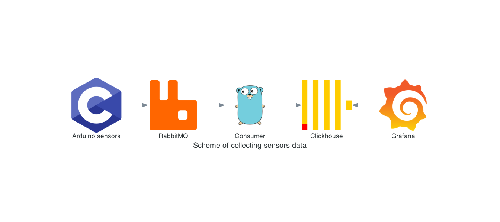
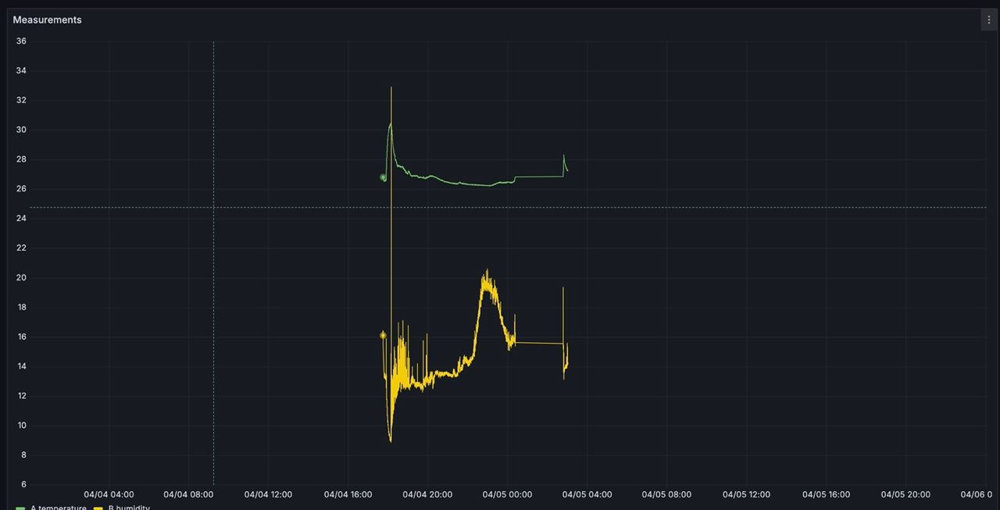

## About

A pet project with an example of using the IOT. In this project, a scheme has been constructed for transmitting measurements from temperature and humidity sensors using the MQTT protocol. There is also a consumer who reads the received measurements and saves them in the Clickhouse. All obtained measurements can be visualized on a dashboard in Grafana.

## Arduino components

- Wemos D1 mini
- Htu21 temperature and humidity sensor
- Troyka RTC module (based on DS1307 chip)
- OLED display

## Arduino scheme

## Architecture

## Up & Running

*device according to the proposed scheme must be assembled independently

`make up`

## Web interfaces
`http://localhost:15672/` - rabbitmq admin pannel, admin/admin  
`http://localhost:3000/`  - grafana web interface, admin/admin  

## Grafana dashboard

The data will be available after the device has been running for some time.

